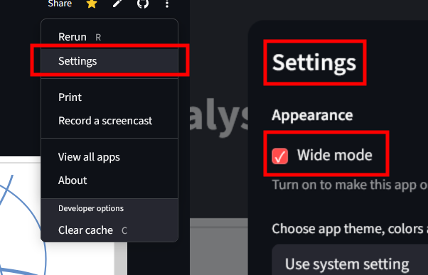

# NetworkAnalysis_Pyvis-Streamlit
Here is the [application](https://networkanalysispyvis-app-tcsujqilwqyjwd8vztjy9n.streamlit.app/). The metrics can be found below the graph by scrolling down, and on the left side there's a dropdown menu with the option to select different views.
On the top right, click "⋮" then "Settings" and check the box "Wide mode" for a better view.

